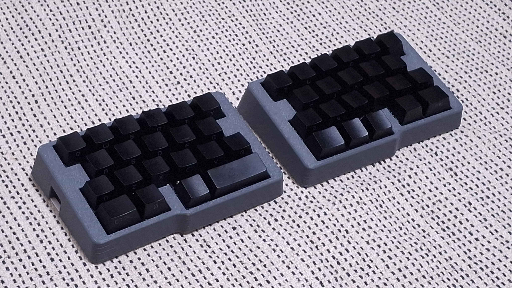
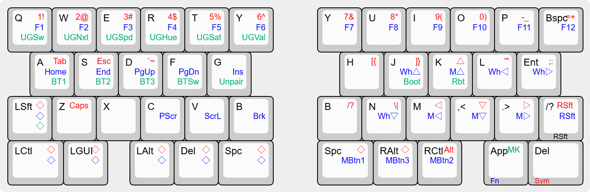
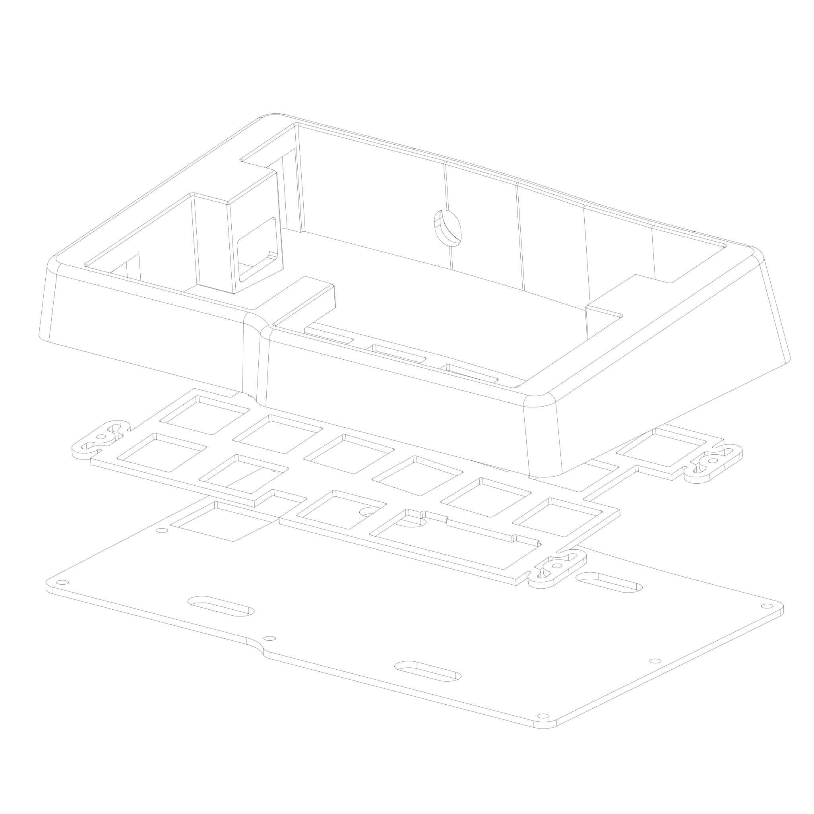
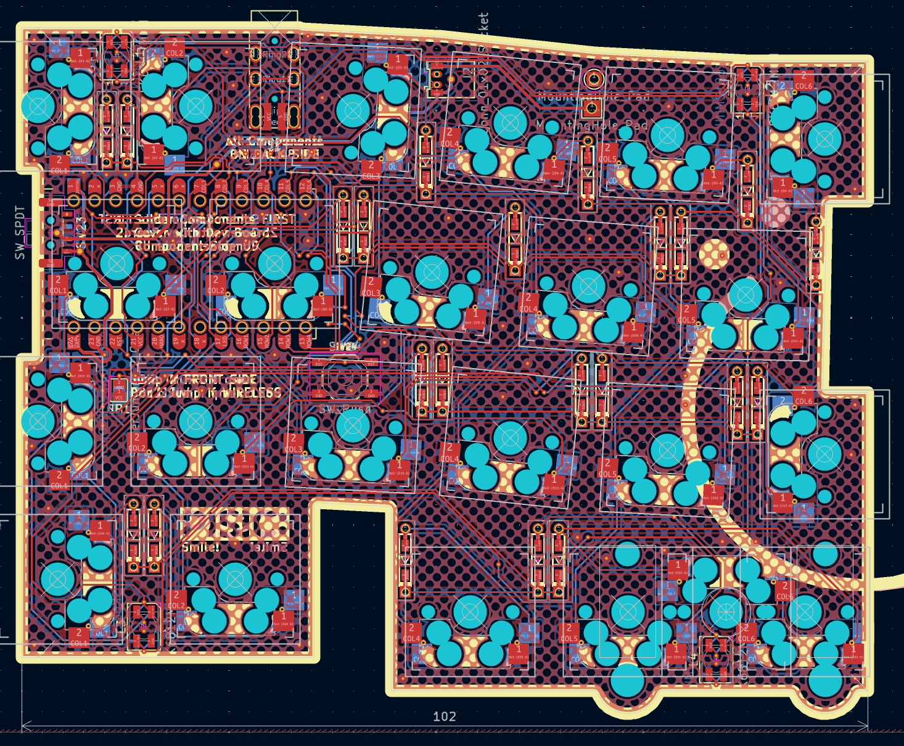

# PISIC
42-44key row staggered split keyboard with GRIN inspired layout, under 102mm PCB

The name PISIC means grin in korean, also is korean pun of grin layout of [ansic](https://github.com/yuburoll/ANSIC).

## Preparation

- 2x pro micro form factor dev board

- 2x PISIC PCB Boards, provided from the repo

- 1x printed case sets, 2 parts total, provided from the repo

- 2x 1.5-1.6T keyboard plates, provided from the repo

- 2x 1.5-1.6T back plates, provided from the repo

- 44x diodes

- 46x Kailh hotswap sockets (or compatibles)

- 24x M2x6 screws, flathead

- 2x PJ320A 1/8(3.5mm) TRRS connector

- 2x 4x4x1.5mm surface mount tact switches (if needed)

- 8x SK6812 Mini or WS2812b Mini (3535) RGB LED (if wanted)

- 1x 1/8(3.5mm) TRRS cable

- 0-2x PCB Mounted 2u Keyboard Stabilizers, normally 1 

- 42-44x MX Keyswitches, normally 43

- 8x 10mm bumpon stickers

- A set of Keycaps

## Build Guides and Miscellaneous

[**PISIC Build Guide**](documents/buildGuide.md)

there's some notices before the build:

- **You may solder all hotswaps before soldering the dev board.**

- Assemble dev board with 2.5mm height pin headers on back side, assume that components side are faced up.

- Jump every jumpers on front side.

- Assemble Case-Plate-Switch first, not Plate-Switch-PCB.

## Default Keymap

There are three more layers - Sym, Fn, Pad - which can be noticed by the color legends. ◇ Means Transparent; which uses base keymap.

Holding the color legend key swaps the layer.

## Licenses

all codes follow MIT license.

all designs and the hardware board follow CC BY-SA 4.0 license.

If you want to make a commercial product, it would be appreciated if you sponsor some bucks for me.

